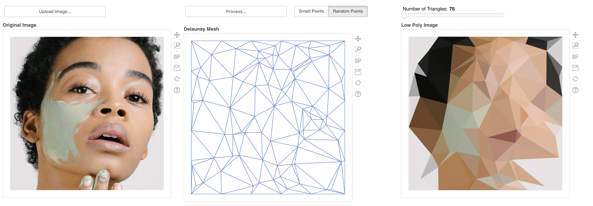
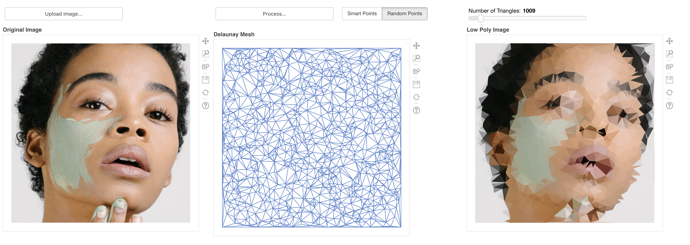
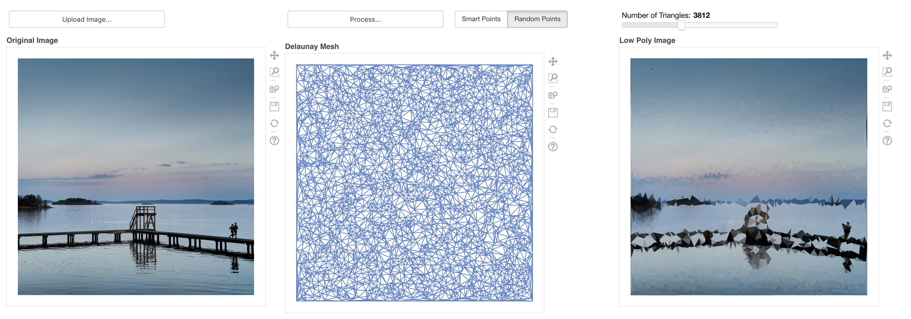
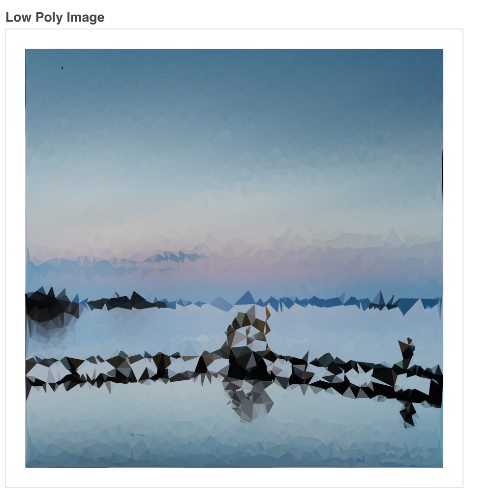
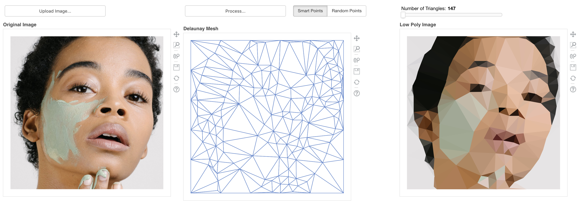

# Low-Poly Image Generator

## How it was built:
This project was built with Python. The libraries I used include:
* SciPy, to generate the Delaunay Mesh
* NumPy, to process image data and for NumPy arrays
* Pandas, to use data frames
* SciKit Image, to determine areas of high entropy on the image
* Bokeh, for everything user interface/display related

## How to try it out for yourself:
To try this project out for yourself, download the source and then run:
```
bokeh serve bokeh-app/
```
Then go to the local instance of the Bokeh Server and play around for yourself.

*Warning:* If you try to generate over 300 "smart points" the app will take a long time to complete all of the processing.

Make sure you are using **Python 2**.

## Sample Screenshots

### Generating Random Points


*An image of a face with 75 random points*


*An image of a face with 1009 random points*


*An image of a dock and lake with 3812 random points*


*A close up of the generated image*

### Generating Smart Points


*An image of a face with 147 smart points*


# Plans for Improvement
Making this in Python was rather simple because of the libraries available and the description provided by [this blog post](http://www.degeneratestate.org/posts/2017/May/24/images-to-triangles/)

However, this implementation is ineffecient and hard to deploy (despite using a bokeh server). I'll try to continue with this project using JavaScript and writing the smart point generation more effeciently.
